#  Pet’Shop – Plateforme E-commerce de Produits pour Animaux

##  Présentation du projet

Pet’Shop est une **plateforme e-commerce dédiée à la vente de produits pour animaux de compagnie** (croquettes, jouets, accessoires, maisons pour animaux, etc.).  
Le projet s’inscrit dans une démarche de **migration d’un commerce traditionnel vers un commerce digital**, en proposant une solution moderne, sécurisée et orientée expérience utilisateur.

Le site a été développé à l’aide du **CMS PrestaShop**, permettant une gestion complète du **front-office** (clients) et du **back-office** (administration).

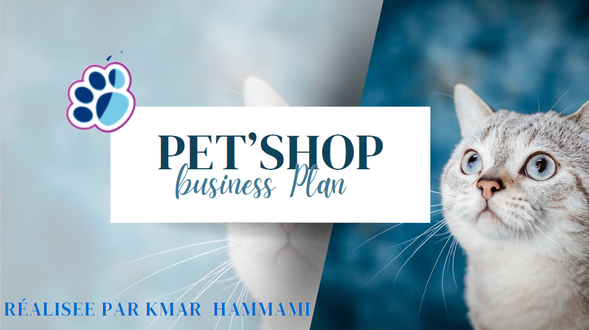

---

##  Objectifs du projet

- Devenir une **référence nationale** dans la vente en ligne de produits pour animaux  
- Proposer une **expérience d’achat fluide, rapide et sécurisée**
- Offrir une **large gamme de produits** adaptée à tous les budgets
- Mettre en place une **stratégie marketing digitale efficace**
- Assurer une **gestion optimisée des stocks et des commandes**

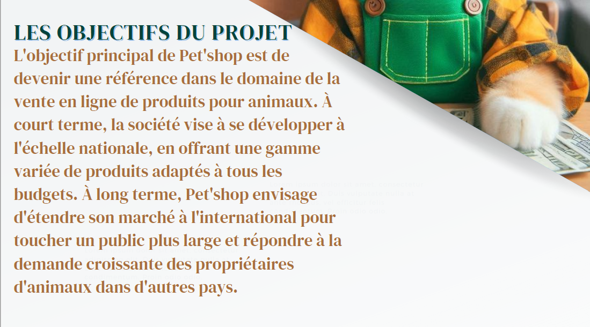

---

##  Contexte & Introduction

Le commerce en ligne a profondément transformé la relation entre entreprises et clients.  
Avec la croissance du nombre de propriétaires d’animaux, le marché des produits pour animaux connaît une forte expansion.

Pet’Shop répond à cette demande en proposant une boutique en ligne spécialisée, combinant **simplicité de navigation**, **qualité des produits** et **sécurité des transactions**.

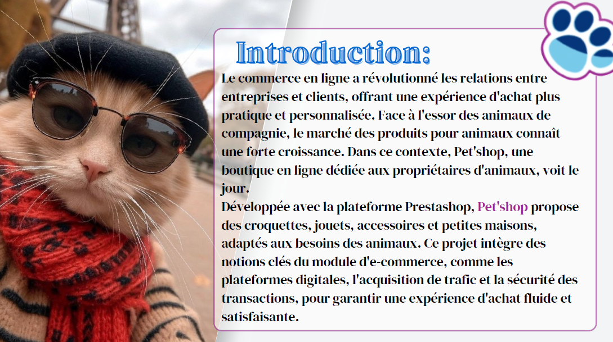

---

##  Fonctionnalités principales

###  Développement From Scratch
- Site e-commerce complet (**front office & back office**)
- Gestion des produits et des stocks
- Mise en place de promotions
- Techniques de commercialisation évolutives

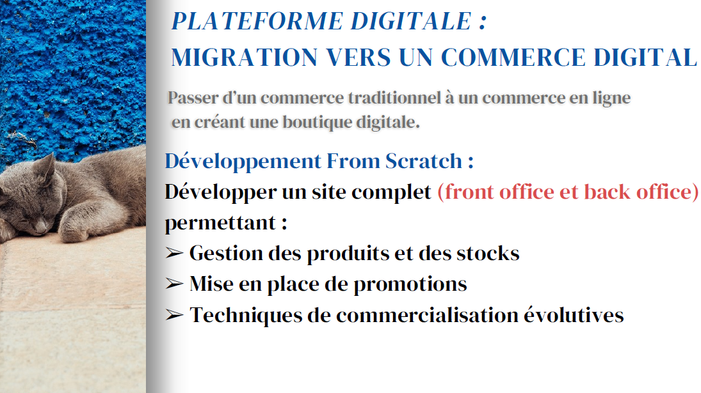

---

##  Technologies & CMS utilisés

###  CMS
- **PrestaShop** : plateforme principale e-commerce

###  CMS de contenu (blogs & pages)
- WordPress  
- Drupal  

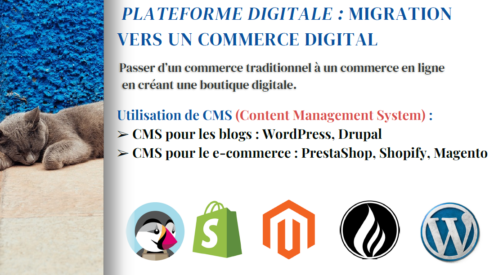

---

##  Stratégie marketing digitale

### Acquisition de trafic
- **SEO** : optimisation du référencement naturel avec des mots-clés ciblés  
- **SEA** : campagnes Google Ads et remarketing  
- **Réseaux sociaux** : publicité via Instagram & Facebook  
- **Influenceurs** : collaborations pour promouvoir les produits

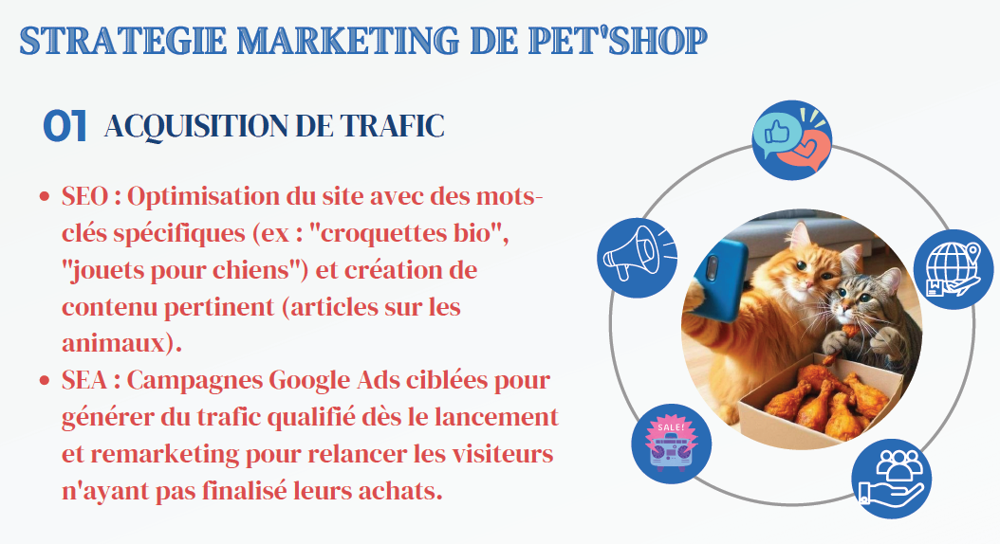

---

##  Mesures de performance (KPIs)

- **Impressions (CPM)** : nombre d’affichages des annonces  
- **Clics** : interaction des utilisateurs  
- **CTR** : taux de clics  
- Analyse des performances publicitaires  
- Relation : `CPM < CPC < CPL < CPA`

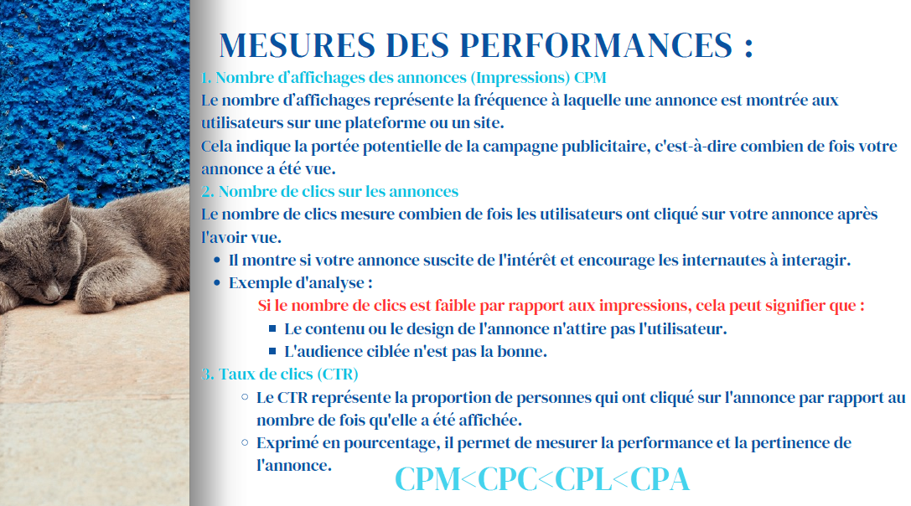

---

##  Paiement & Sécurité

- **SSL (Secure Sockets Layer)** : protection des données échangées  
- **HTTPS** : sécurisation des transactions et confiance client  
- **Cryptage des informations sensibles**

---

##  Équipe du projet

- **Sophie Martin** – Directrice marketing & relation client  
- **Pierre Dupont** – Responsable des opérations & logistique  
- **Claire Durand** – Community Manager  
- **Julien Lefevre** – Développeur web & administrateur PrestaShop  

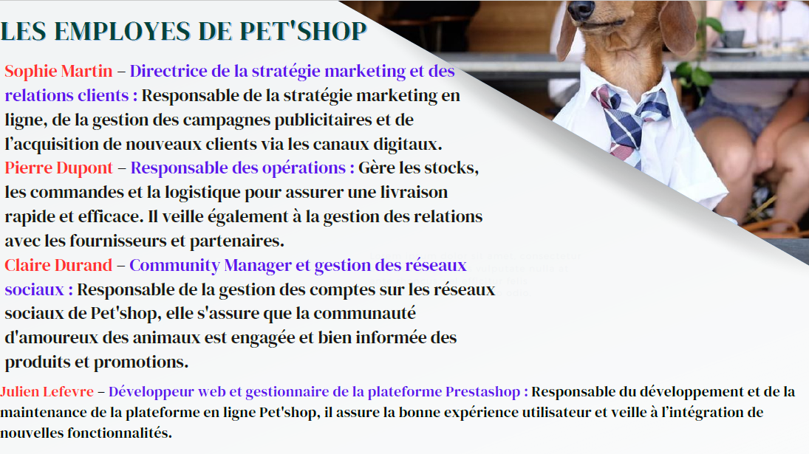

---

##  Étude de marché

### Hypothèses & analyse
- Forte croissance du e-commerce post-Covid
- Demande accrue pour les produits livrés à domicile
- Marché porté par des plateformes existantes (ex : Jumia)

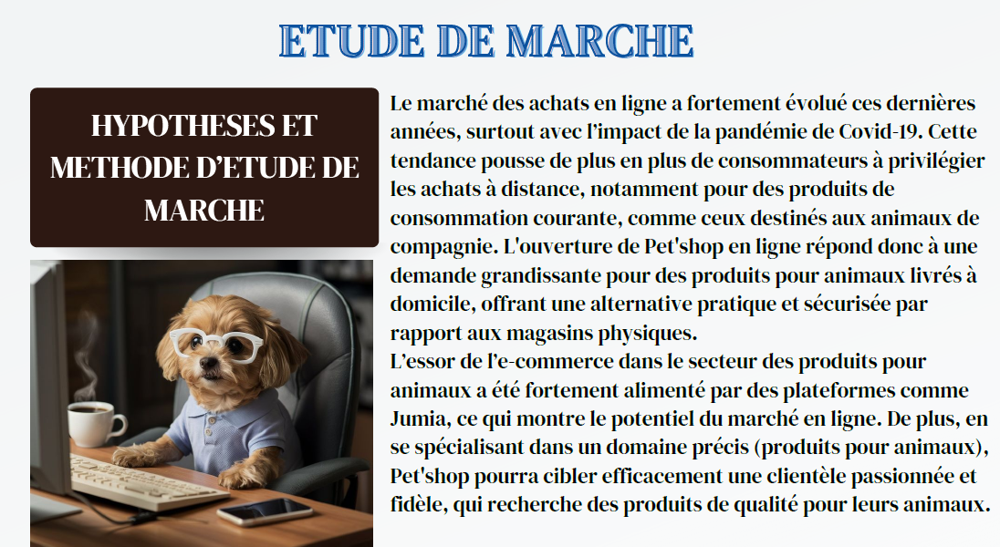

### Caractéristiques de la demande
- Clients recherchant praticité, fiabilité et prix abordables
- Cible principale : **18–35 ans**
- Habitués aux achats en ligne

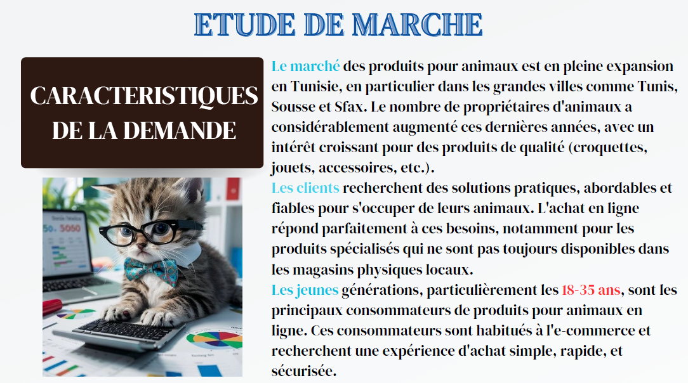

---

##  Aperçu du site – Captures réelles

###  Page d’accueil
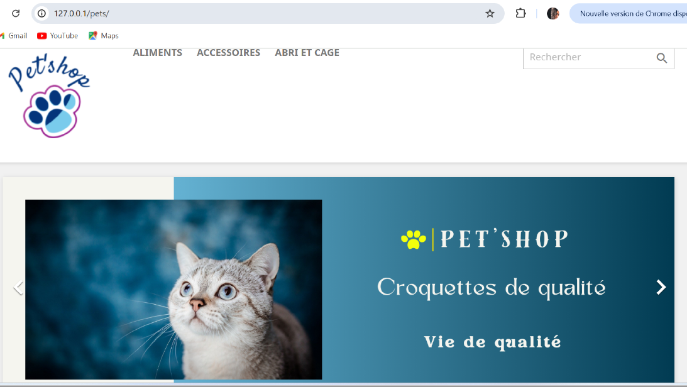

###  Catalogue produits
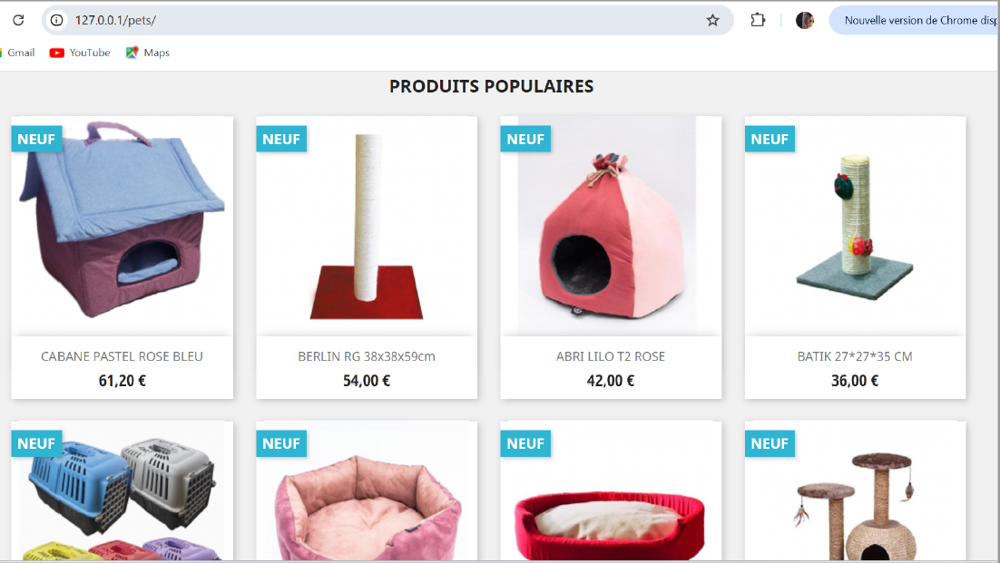

###  Fiche produit
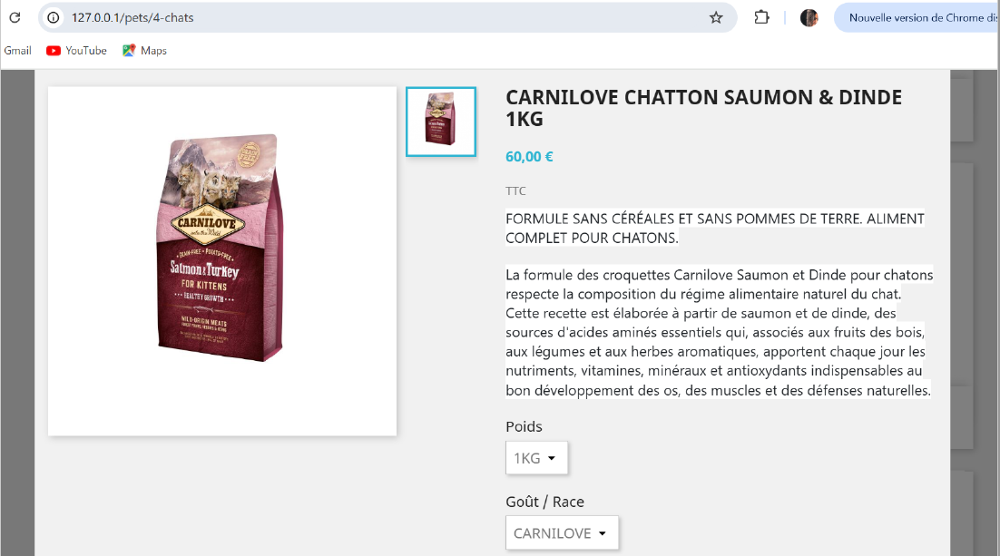

###  Panier
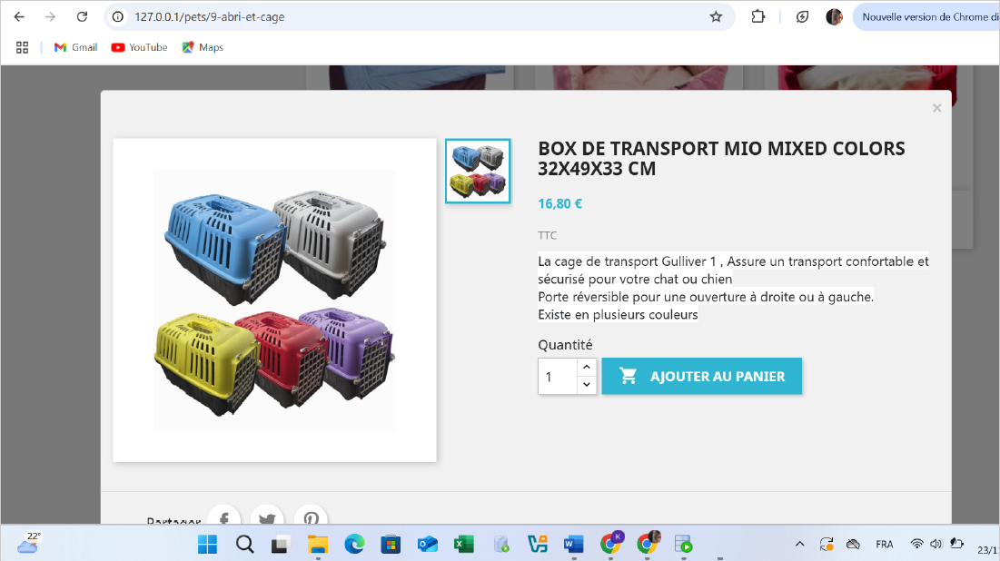

###  Back-Office – Gestion produits
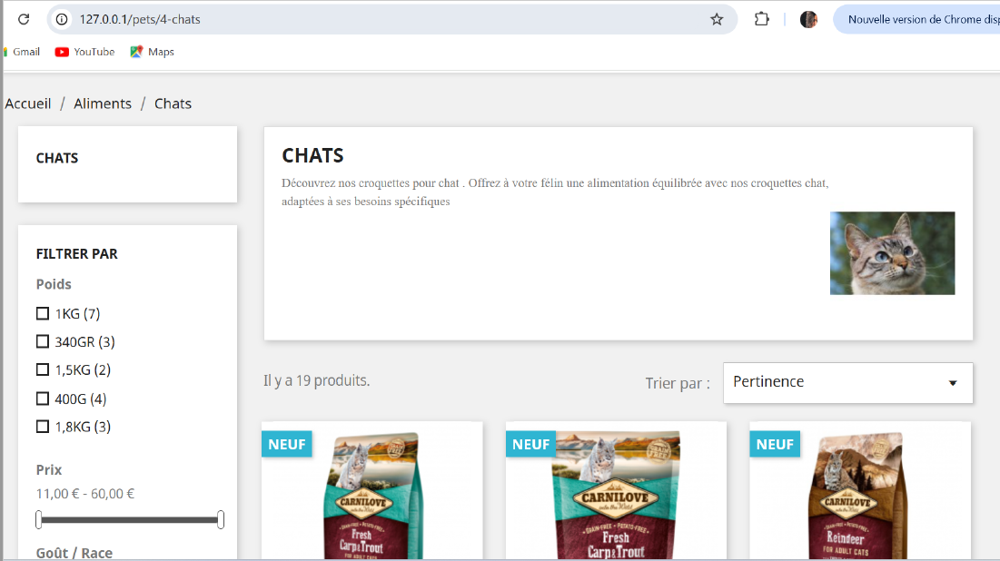

###  Back-Office – Commandes & statistiques
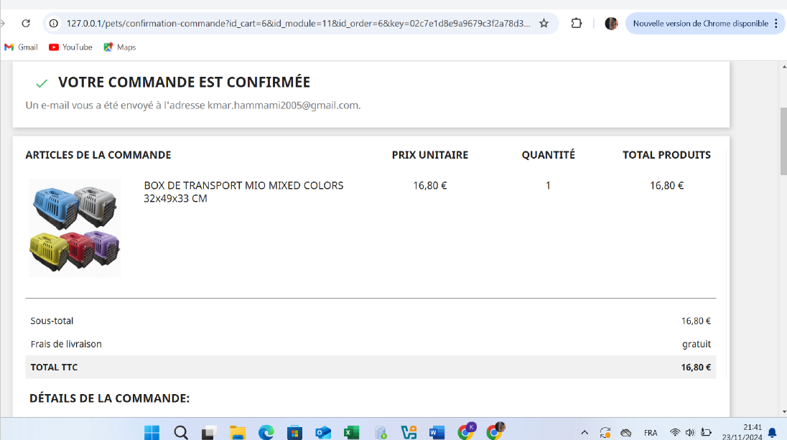

---

##  Conclusion

Pet’Shop est une **solution e-commerce complète**, combinant :
- une **architecture technique solide**
- une **stratégie marketing claire**
- une **interface utilisateur moderne**
- une **gestion professionnelle via PrestaShop**

Ce projet illustre parfaitement la mise en œuvre concrète des concepts de **commerce digital**, **marketing en ligne**, **sécurité web** et **gestion e-commerce**.
